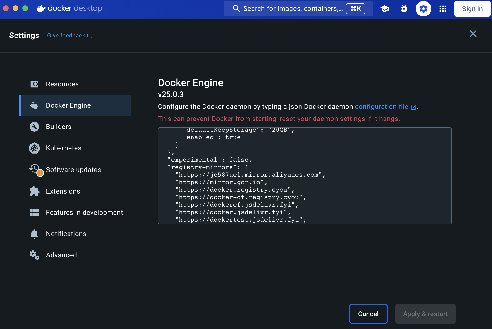

<div align="center">
    <h1>Hadoop3.3.6-Docker_Compose</h1>
	<h3>使用 Docker Compose 一键构建 Hadoop3.3.6</h3>
</div>


## ⚙️ 环境配置

<table style="text-align: center;">
        <tr>
            <td>
                
            </td>
            <td>
              
            </td>
        </tr>
        <tr>
            <td style="font-size: 18px;font-weight: 800;color:white">
                必需安装
            </td>
            <td style="font-size: 18px;font-weight: 800;color:white">
                必需安装
            </td>
        </tr>
    </table>
> 该镜像总大小为 **2.04G**

## Docker Desktop 设置国内镜像源加速  ⚠️

把项目 **docker源.txt** 文件内容粘贴到如下图所示




> [!NOTE]
>
> 在 Windows 下安装 Docker 默认自动安装 Docker-Compose.
>
> 在 Linux 下安装 Dokcer 后还需额外安装 Docker-Compose.
>
> 本项目使用的基础镜像为 Ubuntu 23.10

## 一、双击运行快速启动 🚀

#### Windows

​	1、 双击 **Windows双击我部署.bat**  ，程序自动构建相对应镜像并启动一个 namenode、一个辅助 nanenode 和一个 datanode。

#### Linux

​	1、 进入项目目录使用终端运行 **` bash deploy_hadoop.sh`**  程序自动构建相对应镜像并启动一个 namenode、一个辅助 nanenode 和一个 datanode。

> 等待程序运行完毕后请直接跳转到 **步骤二** 访问网页

## 二、访问 WebUI  📃

#### 🎉 访问 All Applications 和 Namenode information 和 SecondaryNamenode information

> [!TIP]
>
> All Applications :	http://localhost:8088/
>
> Namenode information:	http://localhost:9870/
>
> SecondaryNamenode information：	http://localhost:9868/

## 三、高级

### 1、扩展 datanode

#### 	如果要增加集群中 datanode 的数量

```ini
docker-compose scale datanode=<节点数量>
```

## 四、补充

- 由于 **datanode** 的WebUI端口为 **随机分配** ，因此可选择双击项目 **script/** 文件夹下的 **双击我获取datanode端口.bat** 可执行文件查看类似 **0.0.0.0:63465->9864/tcp** 规则的端口，如上述，**63465** 则为此 **datanode** 的 WebUI 访问端口，在浏览器输入 http://localhost:63465 即可访问。

## 五、引用

- [用于在 Ubuntu 上运行 Hadoop 的 Dockerfile](https://github.com/bigdatafoundation/docker-hadoop)

<div align="center">
	<p>༼ つ ◕_◕ ༽つ   File design By <b>ZivYe</b></p>
</div>
